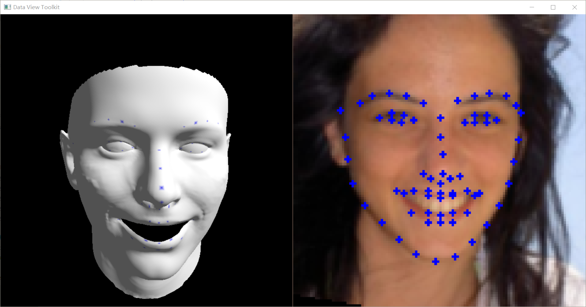

# 基于3DMM的人脸重构
**注意**：由于github的markdown渲染器不支持多行公式，所以该文件的公式显示不全。如果想看正常的公式的话可以去装个浏览器插件或者查看doc文件夹下的ReadMe.pdf
## 演示视频

[基于3DMM的三维人脸重建_哔哩哔哩_bilibili](https://www.bilibili.com/video/BV1La4y1c7Qg/?vd_source=634d041fcc65acb755d5224e2003cc9b)

## 成员列表

* 李昱辉 20060021033 **（组长）**
* 颜慧敏 20020007089
* 杨慧婷 20020007091

## 项目描述
​		基于3DMM实现类似于西瓜头滤镜或是facerig那种自动匹配人脸表情的软件。先通过现有的包实现诸如人脸特征点识别等一系列基础功能，再根据项目进展决定是否展开来逐一实现替换这些基础模块。

最低目标:

> 给定一张2D人脸图像，生成对应的3D模型

最高目标：

> 实现内部用到的所有算法

## 分工

* 李昱辉：
  * 渲染
  * 人脸三维重建
  * 神经网络建立与训练
* 颜慧敏：
  * 人脸特征点识别
* 杨慧婷：
  * 仿射矩阵估计

## 资源

数据库：

> 笔记本前置摄像头    
> [300WLP-3D](http://www.cbsr.ia.ac.cn/users/xiangyuzhu/projects/3ddfa/main.htm)

BFM模型：

> http://faces.cs.unibas.ch/

实现平台：

> Python 3.9.7

第三方库：

> Pytorch, Numpy, Opencv, Dlib, Scipy, PyOpengl

计算资源：

> GPU: NVIDIA GeForce RTX 2070 Super (16G)  
> CPU: Intel(R) Core(TM) i7-10750H CPU @ 2.60GHz

## 运行帮助

1. 下载https://pan.baidu.com/s/1AnBNYe6_CcaC0R8t8YBgSQ?pwd=r22i （提取码：r22i）下的文件，放入根目录的model文件下（如果没有该文件夹请自己创建）
2. 训练模型，运行bin\train.py（训练时间会非常久，建议直接使用我传上网盘已经训练好的fit_model.pth）
3. 运行bin\run.py进行测试

---

# 绪论
​	人脸三维重建就是建立人脸的三维模型，它相对于二维人脸图像多了一个维度，在电影，游戏等领域应用广泛。基于人脸图像的三维重建方法非常多，常见的包括立体匹配，Structure From Motion(简称SfM)，Shape from Shading(简称sfs)，三维可变形人脸模型(3DMM)，我们组的项目就是建立于3DMM之上，本项目中将实现两种基于3DMM重建人脸的算法，一种是通过传统的Analysis-by-Synthesis方法生成3DMM参数。一种是基于神经网络，我们尝试训练了一个CNN网络来直接回归3DMM参数

# 具体方法详解

## 前置通用知识

### 3DMM
​	3DMM，即三维可变形人脸模型，是一个通用的三维人脸模型，用固定的点数来表示人脸。**它的核心思想就是人脸可以在三维空间中进行一一匹配，并且可以由其他许多幅人脸正交基加权线性相加而来**  


​	我们所处的三维空间，每一点(x,y,z)，实际上都是由三维空间三个方向的基量，(1,0,0)，(0,1,0)，(0,0,1)加权相加所得，只是权重分别为x,y,z。转换到三维空间，道理也一样。每一个三维的人脸，可以由一个数据库中的所有人脸组成的基向量空间中进行表示，而求解任意三维人脸的模型，实际上等价于求解各个基向量的系数的问题。人脸的基本属性包括形状、表情和纹理，每一张人脸可以表示为如下所示的形状向量、表情向量和纹理向量的线性叠加。


$$
S_{newModel} = \overline{S}+\sum_{i=1}^{m}\alpha_iS_i+\sum_{i=1}^n\beta_iE_i
$$

$$
T_{newModel} = \overline{T}+\sum_{i=1}^k\gamma_iT_i
$$

​	而其中平均人脸和各属性的主成分都是由数据库生成得来。因此，对于一张人脸图像的人脸重建问题就转变成为了求取形状与表情参数 $\alpha$ 和 $\beta$ 的问题  
​	以下为项目中生成人脸的部分代码

```python
shape = self.shapePC @ self.sp
exp = self.expPC @ self.ep
face = self.shapeMU + shape + exp
```

### BFM模型
​	要使用3DMM模型来完成人脸重建，首先就需要一个数据库来建立人脸基向量空间，Blanz等人在1999年的文章[1]中提出了采集方法，但是没有开源数据集，Pascal Paysan等人在2009年使用激光扫描仪精确采集了200个人脸数据得到了Basel Face Model数据集。2009年发布的Basel Face Model版本中没有表情系数，而2017年发布的版本BFM 2017中提供了表情系数，同样还是一个线性模型。本项目使用的就是**2017年的BFM模型**    
​	模型内会包含如下的我们所需的信息（其中特征点对应的顶点索引并非原生，而是从别处获得的）

|  名称   |         含义         |         格式          |
| :-----: | :------------------: | :-------------------: |
| shapeMU |     平均人脸形状     |     [nver * 3，1]     |
| shapePC |      形状主成分      | [nver * 3，shape_num] |
| shapeEV |    形状主成分方差    |    [shape_num，1]     |
|  expMU  |     平均人脸表情     |     [nver * 3，1]     |
|  expPC  |      表情主成分      |  [nver * 3，exp_num]  |
|  expEV  |    表情主成分方差    |     [exp_num，1]      |
|  texMU  |     平均人脸纹理     |     [nver * 3，1]     |
|  texPC  |      纹理主成分      |  [nver * 3，tex_num]  |
|  texEV  |    纹理主成分方差    |     [tex_num，1]      |
|   tri   |    三角形顶点索引    |      [triNum，3]      |
| kpt_ind | 特征点对应的顶点索引 |         [68,]         |

**以下为读取BFM模型的部分代码**

```python
class MorphabelModel:
    def __init__(self, filePath, **kwarg):
        data = sio.loadmat(filePath)['model']
        self.shapeMU = data['shapeMU'][0, 0].flatten()          #平均人脸形状
        self.shapePC = data['shapePC'][0, 0]                    #形状主成分
        self.shapeEV = data['shapeEV'][0, 0]                    #形状主成分方差
        self.expMU = data['expMU'][0, 0].flatten()              #平均人脸表情
        self.expPC = data['expPC'][0, 0]                        #表情主成分
        self.expEV = data['expEV'][0, 0]                        #表情主成分方差
        self.texMU = data['texMU'][0, 0].flatten()              #平均人脸纹理
        self.texPC = data['texPC'][0, 0]                        #纹理主成分
        self.texEV = data['texEV'][0, 0]                        #纹理主成分方差
        self.tri = (data['tri'][0, 0].T - 1).astype(np.uint32)  #三角面坐标
        self.kptInd = data['kpt_ind'][0, 0][0] - 1              #特征点
        self.nVer = self.shapeMU.shape[0] / 3                   #顶点数量
        self.nTri = self.tri.shape[0]                           #三角面片数量
        self.nSP = self.shapePC.shape[1]                        #形状主成分变量数
        self.nTP = self.texPC.shape[1]                          #纹理主成分变量数
        self.nEP = self.expPC.shape[1]                          #表情主成分变量数
        self.sp = np.zeros(self.nSP)                            #形状主成分变量
        self.tp = np.zeros(self.nTP)                            #纹理主成分变量
        self.ep = np.zeros(self.nEP)                            #表情主成分变量
        self.shapeMU = self.shapeMU + self.expMU
        self.p = np.eye(3)
        self.t = np.zeros(3)
        self.s = 1
```

### 坐标变换

​	老实讲我觉得这部分图形学知识很基础没啥讲的必要，但是我看蛮多3DMM相关的文章都有水这部分内容我就顺带也水一水这些知识，再补个渲染相关的凑凑字数（？  
​	为了对比我们建立的人脸和原始图像的相似关系，我们一般需要将顶点投影到二维坐标下来进行对比。我们求取出的人脸模型他的顶点坐标实际上是位于模型的本地坐标下，而为了把模型渲染回照片我们需要把模型变换到世界空间再变换到视图空间下再通过透视投影和齐次除法到NDC空间最后再转入屏幕空间。其中我们设定相机位于原点且透视投影为正交透视从而规避掉了大部分的变换过程，获得了以下简化的**3维坐标投影到图片坐标的映射关系**：

$$
\begin{aligned}
X_{2d}&=s*P_{orth}*R*X_{3d}+t_{2d}\\\
&=s*P_{orth}*R*(\overline{S}+\sum_{i=1}^{m}\alpha_iS_i+\sum_{i=1}^n\beta_iE_i)+t_{2d}
\end{aligned}
$$

​	其中s为缩放比， $P_{orth}=\begin{bmatrix}1&0&0\\0&1&0\end{bmatrix}$ ， $R$ 为旋转矩阵， $t_{2d}$ 为平移变换

### 光照模型

​	本次项目用的是opengl的可编程渲染管线，我原先是为了说整些风格化渲染的花活所以用的可编程管线，不过迫于时间问题只填入了最基础的光照模型，本次实验的光照为

$$
光照=环境光+漫反射+高光反射
$$

**顶点着色器代码：**

```glsl
#version 330 core

in vec4 a_Position;
in vec3 a_Normal;
in vec3 a_Color;
uniform mat4 u_ProjMatrix;
uniform mat4 u_ViewMatrix;
uniform mat4 u_ModelMatrix;
uniform vec3 u_CamPos;
out vec3 v_Color;
out vec3 v_Normal;
out vec3 v_CamDir;
void main() { 
    gl_Position = u_ProjMatrix * u_ViewMatrix * u_ModelMatrix * a_Position; 
    mat4 NormalMatrix = transpose(inverse(u_ModelMatrix)); // 法向量矩阵
    v_Normal = normalize(vec3(NormalMatrix * vec4(a_Normal, 1.0))); // 重新计算模型变换后的法向量
    v_CamDir = normalize(u_CamPos - vec3(u_ModelMatrix * a_Position)); // 从当前顶点指向相机的向量
    v_Color = a_Color;
}
```

**片元着色器代码：**

```glsl
#version 330 core
 
in vec3 v_Color;
in vec3 v_Normal;
in vec3 v_CamDir;
uniform vec3 u_LightDir; // 定向光方向
uniform vec3 u_LightColor; // 定向光颜色
uniform vec3 u_AmbientColor; // 环境光颜色
uniform float u_Shiny; // 高光系数，非负数，数值越大高光点越小
uniform float u_Specular; // 镜面反射系数，0~1之间的浮点数，影响高光亮度
uniform float u_Diffuse; // 漫反射系数，0~1之间的浮点数，影响表面亮度
uniform float u_Pellucid; // 透光系数，0~1之间的浮点数，影响背面亮
void main() { 
    vec3 lightDir = normalize(-u_LightDir); // 光线向量取反后单位化
    vec3 middleDir = normalize(v_CamDir + lightDir); // 视线和光线的中间向量
    vec4 color = vec4(v_Color, 1);
    float diffuseCos = u_Diffuse * max(0.0, dot(lightDir, v_Normal)); // 光线向量和法向量的内积
    float specularCos = u_Specular * max(0.0, dot(middleDir, v_Normal)); // 中间向量和法向量内
    if (!gl_FrontFacing) 
        diffuseCos *= u_Pellucid; // 背面受透光系数影
    if (diffuseCos == 0.0) 
        specularCos = 0.0;
    else
        specularCos = pow(specularCos, u_Shiny);
    vec3 scatteredLight = min(u_AmbientColor + u_LightColor * diffuseCos, vec3(1.0)); // 散射光
    vec3 reflectedLight = u_LightColor * specularCos; // 反射光
    vec3 rgb = min(color.rgb * (scatteredLight + reflectedLight), vec3(1.0));
    rgb = pow(rgb, vec3(.5));
    gl_FragColor = vec4(rgb, color.a);
} 
```

#### Lambert模型（漫反射）

​	兰伯特反射模型（漫反射）是我们最常用的光照模型之一，也是比较简单的光照模型。兰伯特漫反射模型与视角是相互独立的，其表面的光照分布**不受视角变化的影响**

> Lambert定律：当方向光照射到理想反射体上时，漫反射光的光强与入射光方向和入射点法向量之间夹角的余弦成正比。0~90º范围内夹角越大光线越少  
> $Ild = K * Il * Cos(a)$  
> 其中Ild是漫反射体与方向光交互反射的光强，Il是方向光的光源强度，a是入射光线与定点法向量的夹角，k是材质的反射系数。  
> 若N表示顶点单位法向量，L表示从顶点指向光源位置的单位向量，那么Cos(a)等价于N与L的点积  
> $Ild = k * II * (N · L)$

​	所以 **`漫反射光照 = 反射系数 *（顶点法向量 · 入射光反方向向量）`**

#### Blinn-Phong模型（高光反射）

​	Phong光照模型是用来创建高光效果的。Phong光照模型基于这样的假设：一个模型表面反射的光包括粗糙面的漫反射加上光滑面的高光反射。其表面的光照分布**受视角变化的影响**

> 一个光滑物体被光照射时，可以在某个方向上看到很强的反射光，这是因为在接近镜面反射角的一个区域内，反射了入射光的全部或大部分光强，这种现象称为镜面发射。  
> $Ispec = Ks * Il * (V · R)^n$  
> Ks表示材质的镜面反射系数，n指**高光指数**，V表示从顶点到**视点观察方向**，R表示**反射光方向**。

即 **`高光 = 镜面反射系数 × 光源强度 × （观察方向 · 反射光方向）^ 高光指数`**

​	只有当视线方向与光源的反射光线非常接近时（顶点到视点方向与入射光反方向关于顶点法向量对称），才能看到镜面反射的高光现象。此时，镜面反射光将会在反射方向附近形成亮且小的光斑。**高光指数越小**，表示物体表面**越粗糙**，反射光越分散，观察到的光斑区域**越小**，**强度弱**  
​	Blinn-Phong光照模型是是由Jim Blinn提出的对Phong模型的一种优化。Phong模型需要在每一片元都需要计算光的反射方向向量（这是比较消耗性能的），Blinn-Phong模型只需要计算视角方向和光源方向的和向量（归一化后被称为半角向量），这会得到一个更加柔和的高光显示  
​	同样的高光系数下，Blinn-Phong光照模型**高光领域覆盖范围较大**，**明暗界限不明显**。所以它真实感还没Phong模型强。但是这个模型运算速度要**快**些  
​	在Phong模型中，必须计算V·R（ **视点方向 · 反射方向**）的值，但是在BlinnPhong模型中，用 $N·H$ （**法线方向 · 半角向量**）的值来取代 $V·R$ 

> BlinnPhong光照模型公式：  
>$Ibp = Ks * Il * (N · H)^n$  
> 其中N是入射点的单位法向量，H是光源方向L和视点方向V的中间向量，通常也称为半角向量

即 **`高光 = 镜面反射系数 × 光源强度 × （法线方向 · 视点方向和光源方向的半角向量）^ 高光指数`**

## Analysis-by-Synthesis

​	我们的目标是拿到一张人脸图像后寻找合适的参数拟合出人脸模型使得模型投影出的2d坐标与图像相近，在[前文](#坐标变换)我们已经推导出了模型向图像坐标系的投影公式 $X_{2d}=s*P_{orth}*R*(\overline{S}+\sum_{i=1}^{m}\alpha_iS_i+\sum_{i=1}^n\beta_iE_i)+t_{2d}$ 于是我们可以选取人脸的68个特征点，求解使得**三维模型中的68特征点投影到二维平面上的值与二维平面原68个特征点距离相差最小**的系数。根据最小二乘法，我们可以构建如下的最小化目标

$$
arg\ min\ ||X_{2d}-X^*||^2+\lambda \sum_{i=1}(\frac{\gamma_i}{\sigma_i})^2
$$

​	这里加了正则化部分，其中 $\gamma$ 是PCA系数（包括形状系数 $\alpha$ 以及表情系数 $\beta$ ）， $\sigma$ 表示对应的主成分偏差  
​	到此为止我们总结一下任务，即我们需要求解出系数（ $s、R、t_{2d}、\alpha、\beta$ ）使得目标函数最小，就能得到与图像最相似的人脸模型。于是我们可以根据待定系数法设计出以下的最优化过程

> 1. 将 $\alpha$ 以及 $\beta$ 初始化为0  
> 2. 求出 $s、R、t_{2d}$   
> 3. 固定 $\alpha、s、R、t_{2d}$ 求解 $\beta$ 
> 4. 固定 $\beta、s、R、t_{2d}$求解 $\alpha$ 
> 5. 重复2-4步骤，迭代更新

​	**部分代码**

```python
def fit(self, frame, kptPoints):
    #截取特征点对应的参数
    indices = self.kptInd.astype(np.uint32) * 3
    indices = np.c_[indices, indices + 1, indices + 2].flatten()
    shapeMU = self.shapeMU[indices]
    shapePC = self.shapePC[indices]
    expPC = self.expPC[indic
    #迭代校准
    for i in range(self.maxIter):
        shape = shapePC @ self
        x3d = (shapeMU + shape + expPC @ self.ep).reshape(-1, 3)
        PA = self.__getPAffine(kptPoints.T, x3d)
        s, R, t = self.__P2SRT(
        #self.p[:] = R[...]
        #self.t[:] = t[:]

    	self.ep = self.__estimateExpression(kptPoints, shapeMU, expPC, self.expEV, shape.reshape(-1, 3).T, s, R, t[:2], lamb = 2000).flatten()

    	exp = expPC @ self.ep
    	self.sp = self.__estimateShape(kptPoints, shapeMU, shapePC, self.shapeEV, exp.reshape(-1, 3).T, s, R, t[:2], lamb = 4000).flatten()
```

### **Gold Standard algorithm**

​	如前文所说，我们在第二步需要求解变换参数 $s、R、t_{2d}$ ，他们表示了如何将三维坐标映射到二维坐标，而这一过程同样可以由一个3x4的仿射矩阵 $P_{Affine}$ （后文简写为 $P$ ）来实现：

$$
X_{2d}=P_{Affine}X_{3d}
$$

​	于是，求解 $s、R、t_{2d}$ 的问题可以转变为先求解 $P$ ，再由 $P$ 分解为 $s、R、t_{2d}$  


​	**算法描述如下**

> 1. 归一化，对于二维点（ $x_i$ ），计算一个相似变换$T$，使得 $\tilde{x}=Tx_i$ ，同样的对于三维点，计算 $\tilde{X}=UX_i$ 
> 2. 对于每组对应点 $x_i~X_i$ ，都有 $\begin{bmatrix}\tilde{X_i^T}&0^T\\0^T&\tilde{X_i^T}\end{bmatrix}\begin{pmatrix}\tilde{P^1}\\\tilde{P^2}\end{pmatrix}=\begin{pmatrix}\tilde{x_i}\\\tilde{y_i}\end{pmatrix}$ ，形同 $Ax=b$ 
> 3. 求解A的伪逆
> 4. 去除归一化，得到仿射矩阵 $P$ 
> 5. 将 $P$ 分解出 $s、R、t_{2d}$ 

​	**部分代码**

```python
def __getPAffine(self, x2d, x3d):
    '''获取仿射矩阵'''
    n = x2d.shape[0]
    
    #normalization
    #处理2维点
    #平移所有坐标点，使它们的质心位于原点
    mean = x2d.mean(0)
    x2d = x2d - mean
    
    #对这些点进行缩放，使到原点的平均距离等于根号二
    avgDIs = np.mean(np.linalg.norm(x2d, axis=1))
    scale = np.sqrt(2) / avgDIs
    x2d = x2d * scale
    
    #获取变化矩阵T
    T = np.identity(3, dtype = np.float32)
    T[0, 0] = T[1, 1] = scale
    T[:2, 2] = -mean * scale
    
    #处理3维点
    #平移所有坐标点，使它们的质心位于原点
    mean = x3d.mean(0)
    x3d = x3d - mean
    
    #对这些点进行缩放，使到原点的平均距离等于根号三
    avgDIs = np.mean(np.linalg.norm(x3d, axis=1))
    scale = np.sqrt(3) / avgDIs
    x3d = x3d * scale
    
    #获取变化矩阵U
    U = np.identity(4, dtype = np.float32)
    U[0, 0] = U[1, 1] = U[2, 2] = scale
    U[:3, 3] = -mean * scale
    
    #equations
    A = np.zeros((n * 2, 8), dtype=np.float32)
    xhat = np.c_[x3d, np.zeros(n)]
    A[:n, :4] = xhat
    A[n:, 4:] = xhat
    b = x2d.flatten('f')
    
    #solution
    p8 = np.linalg.pinv(A) @ b
    P = np.zeros([3, 4])
    P[0, :] = p8[:4]
    P[1, :] = p8[4:]
    P[2, 3] = 1
    
    #denormalization
    return np.linalg.pinv(T) @ P @ U

def __P2SRT(self, P):
    '''仿射矩阵求S、R、T'''
    t = P[:, 3]
    r1 = P[0, :3]
    r2 = P[1, :3]
    nr1 = np.linalg.norm(r1)
    nr2 = np.linalg.norm(r2)
    s = (nr1 + nr2) / 2
    r1 = r1 / nr1
    r2 = r2 / nr2
    r3 = np.cross(r1, r2)
    R = np.c_[(r1, r2, r3)].T
    return s, R, t
```

### 求解 $\alpha$ 和 $\beta$ 

​	如前文所述，当我们求解完变换参数后，就需要依次固定 $\alpha$ 和 $\beta$ 求解相对的参数，下面我们将推导如何求取 $\beta$ 
​	已知公式 $X_{2d}=s*P_{orth}*R*(\overline{S}+\sum_{i=1}^{m}\alpha_iS_i+\sum_{i=1}^n\beta_iE_i)+t_{2d}$  

$$
定义:\begin{cases}A=s*P_{orth}*R\\pc=A*\sum_{i=1}^nE_i\\b=A*(\overline{S}+\sum_{i=1}^{m}\alpha_iS_i)+t_{2d}\end{cases}
$$

​	将上述定义带入可推导得  

$$
\begin{aligned}
X_{2d}&=s*P_{orth}*R*(\overline{S}+\sum_{i=1}^{m}\alpha_iS_i+\sum_{i=1}^n\beta_iE_i)+t_{2d}\\
&=A*\sum_{i=1}^n\beta_iE_i+b\\
&=pc·\beta+b
\end{aligned}
$$

​	我们将上述公式代入目标函数得

$$
\begin{aligned}
Loss=&||X_{2d}-X^*||^2+\lambda \sum_{i=1}(\frac{\gamma_i}{\sigma_i})^2\\
=&||pc·\beta+b-X^*||^2+\lambda \sum_{i=1}(\frac{\gamma_i}{\sigma_i})^2
\end{aligned}
$$

​	对 $\beta$ 求偏导得

$$
\frac{\partial Loss}{\partial \beta}=2pc^T·(pc·\beta+b-X^*)+2\lambda\frac{\beta}{\sigma^T·\sigma}
$$

​	令偏导为0即可求得 $\beta$ 

$$
\begin{aligned}
2pc^T·(pc·\beta+b-X^*)+2\lambda\frac{\beta}{\sigma^T·\sigma}&=0\\
(pc^T·pc+\frac{\lambda}{\sigma^T·\sigma})·\beta&=pc^T·(X^*-b)\\
\beta&=(pc^T·pc+\frac{\lambda}{\sigma^T·\sigma})^{-1}·pc^T·(X^*-b)
\end{aligned}
$$

​	同理我们也可以得到 $\alpha$ 的求解公式，通过多次迭代即可求出相应的解  
​	**部分代码**

```python
def __estimateExpression(self, x, shapeMU, expPC, expEV, shape, s, R, t2d, lamb):
    P = np.array([[1, 0, 0], [0, 1, 0]], dtype = np.float32)  # [2, 3]
    A = s*P.dot(R)  # [2, 3]
    pc = (expPC.T.reshape(-1, 3) @ A.T).reshape(expPC.shape[1], -1).T  # [2 * nver, exp_num]
    b = A @ (shapeMU.reshape(-1, 3).T + shape) + t2d[:, None]  # [2, nver]
    equation_left = pc.T @ pc + lamb * np.diagflat(1/expEV**2)  # [exp_num, exp_num]
    equation_right = pc.T @ (x - b).T.flatten()  # [exp_num,]
    return np.linalg.inv(equation_left) @ equation_right

def __estimateShape(self, x, shapeMU, shapePC, shapeEV, expression, s, R, t2d, lamb):
    P = np.array([[1, 0, 0], [0, 1, 0]], dtype = np.float32)  # [2, 3]
    A = s*P.dot(R)  # [2, 3]
    pc = (shapePC.T.reshape(-1, 3) @ A.T).reshape(shapePC.shape[1], -1).T  # [2 * nver, shape_num]
    b = A @ (shapeMU.reshape(-1, 3).T + expression) + t2d[:, None]  # [2, nver]
    equation_left = pc.T @ pc + lamb * np.diagflat(1/shapeEV**2)  # [shape_num, shape_num]
    equation_right = pc.T @ (x - b).T.flatten()  # [shape_num,]
    return np.linalg.inv(equation_left) @ equation_right
```

## 深度学习

​	随着深度学习的发展，越来越多的CNN结构被提出，使得图像特征的提取变得越发的简单有效。在这个基础上，与图像相关的“**基于图像的人脸重建**”也有了长足的进步与发展。但是由于3维模型的数据量过大，如何合理、有效的使用CNN进行人脸重建也存在一个问题。在这次项目中我们尝试了多种的方式来通过CNN直接回归3DMM参数  
​	原本还想水一节CNN的基础的，不过看了看字数也已经很多了就算了吧（？

### Regressing robust and discriminative 3D morphable models with a very deep neural network

​	这个方法我看也没人给出个简化名，我就干脆用论文标题做标题了

​	有人提出借助CNN对图像强大的特征提取能力，来对3DMM系数进行估计的想法，在2017年的CVPR中，“Regressing robust and discriminative 3D morphable models with a very deep neural network.”，这篇论文便使用Resnet-101进行3DMM系数的估计。


​	这篇论文主要解决了两个问题，一个是训练数据不足而从没有3dmm参数的图片生成数据集，一个是生成更具有鲁棒性的人脸。由于我在实验中使用的是已经带有参数的人脸数据集所以我略去了生成数据的这个步骤，更着重于利用resnet回归3dmm参数的部分  
​	论文通过将人脸图像直接传入修改了最后一层连接层的ResNet-101网络来回归198维的人脸形状参数，而这篇论文相对于直接回归做出的改进在于他设计了一个损失函数而不是直接使用MSE  
​	作者提出了一个非对称欧拉损失，使模型学习到更多的细节特征，使三维人脸模型具有更多的区别性，公式如下：


​	因为在回归多个参数的任务中，一般假设得到的参数服从多元正态分布（隐含条件为参数部分以原点为均值，在原点两侧分布），因此在进行训练的时候，得到的参数可能会比label更加靠近原点（如果过于靠近原点，那么得到的人脸模型往往会与平均人脸模型相似）， 因此在进行训练的时候，不仅仅要满足得到的参数值与label相近，也要满足得到的参数值尽可能远离原点，这样才能得到更具特征的人脸。  
​	损失函数里的两个Loss项代表着:

1. over-estimate：当预测得到的值相较于label比原点更远， $\lambda_1=1$ ，占较小的权重
2. under-estimate：即预测得到的值相较于label比原点更近， $\lambda_2=3$ ，占较大的权重

**部分代码**  

```python
class CustomLoss(nn.Module):
    def __init__(self, lambda1=1, lambda2=3):
        super(CustomLoss, self).__init__()
        self.lambda1 = lambda1
        self.lambda2 = lambda2

    def forward(self, x, y):
        ys = torch.sign(y)
        yp = y * ys
        xp = x * ys
        ymax = torch.max(yp, xp)
        return self.lambda1 * F.mse_loss(yp, ymax) + self.lambda2 * F.mse_loss(xp, ymax)
```

​	论文提供了他们的训练参数mini-batch为144，动量为0.9，L2 weight decay为0.0005的SGD优化器来训练模型。学习速率为0.01.当验证集loss饱和后，降低学习速率直至验证集loss停止下降。 
​	但是在我的实验过程中由于我的移动端2070s和内存限制根本支撑不起这么大的批大小以及上万的图像数据集，在训练了几天后发现效果实在不佳<s>（根本没有人样）</s>于是舍弃了这个办法，转而采用下文将要介绍的2DASL

### 2DASL

​	一句话概括这篇论文，这篇论文提出的方法叫做`2D-assisted self-supervised learning`，简称为2DASL，其实核心思想就是通过CNN来回归3DMM系数，所以说并没有摆脱3DMM的框架，但是比较新颖的一点是借助自监督训练，解决了人脸三维数据集不足的问题，具体贡献如下所示：

1. 一般的三维人脸重建方法都过多依赖于三维标注的数据集，但是本文提出了一种自监督训练的方法能够充分利用未标注的野生（in-the-wild）数据辅助人脸三维重建，不再依赖于稀缺的数据集
2. 其中发明了一种“自我评估训练”（self-critic）的方法能够有效地提升模型的学习质量（后文可知类似于GAN网络），尽管标注的野生的数据可能有噪声
3. 在AFLW2000-3D数据集和AFLW-LFPA数据集上的实验表明本文的方法对于人脸重建与稠密人脸对齐都有比较好的效果


​	网络构成：CNN Regressor为ResNet-50，Encoder包含6个卷积层，每个卷积层后面是ReLU和最大池化层。critic由4个完全连接层构成，分别由512、1024、1024、1个神经元组成，接着一个softmax层，获得输入对的一致性程度得分。

​	输入：CNN Regressor采用4通道张量作为输入，连接3通道RGB人脸图像和1通道2D人脸特征点图（FLM，一个二值图像，与人脸特征点对应取1，其他位置取-1）。输入图像裁剪为120×120。

​	输出：*f*尺度因子，t平移向量，Π由9个参数构成的投影矩阵，40个人脸形状表示参数，10个人脸表情参数，共62个参数。

​	我们回顾一下先前的知识，对于一张人脸图片来说它对应的人脸可以表示为 $S = \overline{S}+A_s\alpha_s+A_{exp}\alpha_{exp}$ ，而将人脸映射到二维图像坐标系可以通过 $V=f*Pr*\Pi*S+t$ （此处的公式与上文不同是因为我采用了论文中对应的符号，你们对照的看就行），因此我们归纳一下所需要获得的参数有*f*尺度因子，t平移向量，Π投影矩阵， $\alpha_s$ 人脸形状参数（选取前40个）， $\alpha_{exp}$ 人脸表情参数（选取前10个），将这些组合起来就得到了我们需要回归的参数

$$
\alpha=[f,t,\Pi,\alpha_s,\alpha_{exp}]
$$

​	从上面的图像我们可以得知2DASL有两条训练路线分别使用两组图像训练模型，即具有3DMM ground truth的2D图像和仅具有2D面部特征点注释的2D面部图像（2D特征点利用已有的特征点检测算法得到）。 通过最小化以下的一个传统的3D监督函数和四个自监督损失来训练该模型。

​	**损失函数计算部分代码**

```python
#l2dcon计算
def l2dcon(x, y):
    '''
    Args:
        x: [batch_size, nver, 2]
        y: [batch_size, nver, 2]
    '''
    x = x[:,L2DCON_IND,:]
    y = y[:,L2DCON_IND,:]
    loss = F.mse_loss(x, y, reduction='none')
    loss = loss * L2DCON_WEIGHTS[None, :, None]
    return loss.mean()


# 损失函数计算
				x1 = torch.cat([inputs, flms], 1)
                optimizer.zero_grad()
                outputs = net(x1)

                x2d = projection(getVertexes(labels[:,12:12+SHAPE_NUM], labels[:,12+SHAPE_NUM:])
                                 , labels[:,0], labels[:,3:12], labels[:,1:3])  # [batch_size, nver, 2]
                x3d = getVertexes(outputs[:,12:12+SHAPE_NUM], outputs[:,12+SHAPE_NUM:])  # [batch_size, nver, 3]
                y2d = projection(x3d, outputs[:,0], outputs[:,3:12], outputs[:,1:3])  # [batch_size, nver, 2]

                flms2 = torch.full_like(flms, -1)
                ind = torch.clamp(y2d.int(), 0, INPUT_SIZE - 1)
                indx = ind[:,:,0].flatten()
                indy = ind[:,:,1].flatten()
                indn = torch.arange(y2d.shape[0])[:,None].repeat(1, y2d.shape[1]).flatten()
                flms2[indn, :, indy, indx] = 1

                x2 = torch.cat([inputs, flms2], 1)
                outputs2 = net(x2)

                x3dHat = getVertexes(outputs2[:,12:12+SHAPE_NUM], outputs2[:,12+SHAPE_NUM:])
                x2dHat = projection(x3dHat, outputs2[:,0], outputs2[:,3:12], outputs2[:,1:3])


                loss3d = F.mse_loss(outputs, labels, reduction='none')
                loss3d = loss3d * L3D_WEIGHTS[None, :]
                loss3d = loss3d.mean()
                loss2dcon = l2dcon(x2d, y2d)
                loss3dcon = F.mse_loss(x3d, x3dHat)
                losscyc = l2dcon(x2d, x2dHat)
                loss = loss3d + LAMBDAS[0] * loss2dcon + LAMBDAS[1] * loss3dcon + LAMBDAS[2] * losscyc
```


#### Weighted 3DMM coefficient supervision

​	这个传统的3D监督函数是Weighted 3DMM coefficient supervision，其用来测量模型预测的3DMM系数的准确度。利用ground truth的3DMM系数监督模型的训练，以此使得模型预测的系数 $\hat{\alpha}$ 更接近ground truth系数 $\alpha^*$ 。此外作者还明确地考虑每个系数的重要性，并相应地重新衡量它们对损失计算的贡献。这样得到weighted coefficient prediction loss：


​	其中， $\omega_i$ 表示第i个系数的重要性 ，根据投影后2D特征点位置引入的误差计算。 $H(·)$ 表示3D shape投影， $\hat{\alpha}_i$ 表示的是第i个系数来自 $\hat{\alpha}$ 而其他的系数来自 $\alpha^*$ 。作者这样做的原因是，通过引入这样一个重新加权方案，在模型训练期间，CNN模型将首先关注学习权重较大的系数（例如，用于旋转和平移的系数）。在减少误差和权重后，模型再优化其他系数（例如identity和expression的系数）。（其实就是借鉴了坐标下降法的思想)。

#### 2D assisted selfsupervised learning

​	由于3D数据的不足，想要充分利用2D图像进行训练（这些图像可以通过特征点检测算法得到稀疏的2D特征点），就必须要引入新颖的自监督方案，这也是此篇论文的出发点之一。自监督方案包含有三种不同的自监督损失，包括2D特征点一致性损失 $L_{2d-con}$ ，3D特征点一致性损失 $L_{3d-con}$ 和循环一致性损失（cycle-consistency) $L_{cyc}$ 。 

​	我们可以这样理解这三个损失，直观上如果网络模型足够好的话，那它应该保证三种一致性：

1. 以原始2D特征点 $X_{2d}$ 作为模型输入，将模型预测得到的3D特征点 $X_{3d}$ 投影会得到2D特征点 $Y_{2d}$ ,投影得到的2D特征点与模型的输入的2D特征点 $X_{2d}$ 要尽可能接近的；

2. 反过来，如果将 $Y_{2d}$ 输入模型，那预测到的3D特征点与 $X_{3d}$ 也是要非常接近的；

3. 接着如果对 $\hat{X}_{3d}$ 做投影得到的 $\hat{X}_{2d}$ 应该与 $X_{2d}$ 一致。这样就形成了循环一致性。


#### Self-critic learning

​	（我只实现了真实数据的训练，这一部分无标签数据的训练我没进行）接着进一步引入了一种自评估（self-critic），用“in-the-wild”2D人脸图像来弱化监督模型训练。这一部分就是整个网络框架的第三个模块，这一模块的输入有两个人脸图像集，一个没有任何3D注释 $I=\{I_1,\dots,I_n\}$ ,一个带有ground truth的3DMM系数 $J=\{(J_1,\alpha^*),\dots,(J_m,\alpha_m^*)\}$ ，CNN回归模型会预测 $I_i$ 的3DMM系数 $\alpha_i$ 。将两组图像输入，经过encoder之后得到图像的 $\tilde{z}$ ，然后结合对应的3DMM系数通过一个判别器。此模块需要优化一个损失函数：


​	至此，整体损失函数为 $L=L_{3d}+\lambda_1L_{2d-con}+\lambda_2L_{3d-con}+\lambda_3L_{cyc}+\lambda_4L_{sc}$ 

# 结果

## 图片重构

|                        数据集原生标签                        |                    Analysis-by-Synthesis                     |                            2DASL                             |
| :----------------------------------------------------------: | :----------------------------------------------------------: | :----------------------------------------------------------: |
|  |                      |  |
|  |  |  |
|  |  |  |

## 实时重构

（采用的Analysis-by-Synthesis）


# 总结和讨论

​	从整体上而言这个项目的难度适中没有太多难点。我可能被卡着最久的还是机器过于羸弱训练不动模型，等这台机子退休了我就狠狠地整台高配台式来工作。还有就是平常被unity和shadertoy这种可以直接写shdaer的网站惯坏了，我对opengl的api完全不熟，他那VAO和VBO的机制我还是现学的。对于这次实验我们尝试了三种方法来进行人脸重建一种是传统的最优化两种是深度学习，从结果来说是Analysis-by-Synthesis的效果最好，而两种深度学习的方法都有他的明显问题（其中一种由于连人样都没有了，被我直接放逐了故而没有展示）。Analysis-by-Synthesis产生的人脸会比较偏向于平均人脸缺乏独特性，我觉得可能是因为优化的目标函数仅针对于68个特征点投影后的值与真实值的差距而丢失了图像的部分信息，如果我们选择把相机参数和光照参数以及纹理参数都纳入考虑，通过可微的渲染器渲染出预测图像，选用预测图像和原图像的差距来作为最小化目标或许能够获得更加精确符合原图像的模型。不过采取这种方式也可能会使得得到的3D模型对于这单张图像过拟合？或许还应该选一种方式通过对同一物体的多视角图进行处理来规避这种缺点。至于2DASL从结果上来看我觉得是失败的，通过2DASL生成的人脸其实变化不大且表情基本上没有体现，或许是因为我炼丹技术过于生涩，模型训练的不到位，又或者是只选取40个形状参数和10个表情参数不足以支撑住人脸的丰富性，或许可以在未来有条件了试试采用更大的数据量以及更多的输出参数来看看效果会不会有所改善。

# 个人贡献声明

* 李昱辉（50%）
  * 渲染器编写
  * Analysis-by-Synthesis算法编写
  * 2DASL算法编写
  * 神经网络建立与训练
* 颜慧敏（30%）
  * 视频剪辑
  * BFM模型读取
  * 特征点识别
* 杨慧婷（20%）
  * 视频录制
  * 坐标变换
  * 资料查询

# 引用参考

1. [Regressing Robust and Discriminative 3D Morphable Models With a Very Deep Neural Network - Tal Hassner](https://talhassner.github.io/home/publication/2017_CVPR)
2. [[1903.09359\] 3D Face Reconstruction from A Single Image Assisted by 2D Face Images in the Wild (arxiv.org)](https://arxiv.org/abs/1903.09359)
3. [yfeng95/face3d: Python tools for 3D face: 3DMM, Mesh processing(transform, camera, light, render), 3D face representations. (github.com)](https://github.com/yfeng95/face3d)
4. [BFM模型](http://faces.cs.unibas.ch/)
5. [300WLP-3D](http://www.cbsr.ia.ac.cn/users/xiangyuzhu/projects/3ddfa/main.htm)
